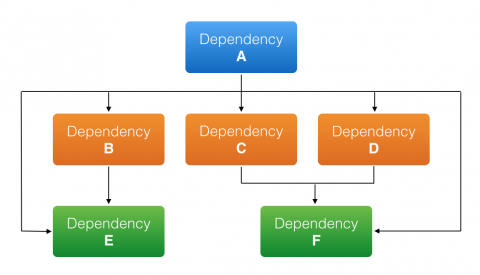

# Mr-Dependency
Dependency analyzer for maven projects

## Overview
- Recently I encountered a problem in my project where there was a transitive dependency which was causing a version related troubles and I was trying to figure out where and all its reference are exactly there. Not only it was very difficult to find, there was no proper utilities to find it as well.

## Idea
- I am trying to develop a small project which will use code base and pom.xml to present complete analysis of dependencies and place of usages in a interactive UI.

## Problem
- Need to get all transitive dependencies in code
- Need to find usage of existing library in code
- Need to confirm if transitive dependency can be ignored(if usage is null)
- Need to confirm if transitive dependency is directly referred anywhere

 
